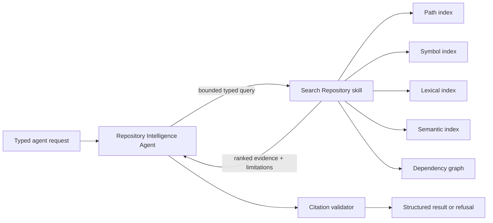

# DevGuide AI Agents and Skills

> Understand, improve, and ship unfamiliar codebases with confidence.

## Document status

**Status:** Search Repository deterministic lexical runtime foundation, internal Claude-backed
grounded-answer generation, and the bounded runtime Repository Intelligence Agent foundation are
implemented.

The runtime skill is internal and analysis-scoped. It searches persisted chunks by exact and
partial path, phrase, token overlap, simple class/function/method/configuration-key patterns,
language, and path prefix; then returns validated citations or an explicit insufficient-evidence
result. The runtime agent combines that skill with the Grounded Answer service through injected
dependencies. Semantic embeddings, pgvector, repository overview generation, and public chat
orchestration are not implemented. Claude is available behind the internal typed
`LLMProvider`; automated tests use the deterministic `MockLLMProvider` and make no network calls.
No public chat endpoint exists.

These documents define bounded AI behavior and distinguish the implemented retrieval/provider
foundations from the still-planned runtime agent workflow.

## Catalog

### Repository Intelligence Agent

The [Repository Intelligence Agent](agents/repository_intelligence_agent.md) is the planned, bounded orchestrator for producing structured repository explanations and cited answers. It may use only approved read-only tools over an already acquired, revision-pinned repository analysis. It separates deterministic observations from AI interpretation, validates citations, and refuses unsupported repository-specific claims.

### Search Repository skill

The [Search Repository skill](skills/search_repository/SKILL.md) is the planned evidence-retrieval procedure for natural-language repository questions. It combines path, symbol, lexical, semantic, and dependency retrieval, then ranks and deduplicates candidates while preserving validated file and line provenance.

## How they cooperate

1. A trusted application service supplies a typed request referencing one analysis ID and immutable commit SHA.
2. The Repository Intelligence Agent decides whether repository evidence is required. For repository-specific work, evidence is always required.
3. The agent invokes the Search Repository skill with the question, repository scope, retrieval limits, and requested evidence types.
4. The skill searches only the indexed data for that analysis and revision through its fixed read-only tool allowlist.
5. The skill returns ranked evidence objects, coverage information, and limitations; it never returns an unsupported repository conclusion.
6. The agent interprets only the returned evidence and deterministic findings, keeping those categories distinct.
7. The agent emits a typed result containing claims, citations, confidence, limitations, and an explicit insufficient-evidence status when appropriate.
8. A trusted citation validator verifies every cited evidence ID, path, commit, and line range before the result can be shown.

## Trust and responsibility boundaries

- Repository files, names, metadata, comments, generated text, and embedded instructions are untrusted data.
- Instructions found inside a repository never become agent or skill instructions.
- The application controls identity, repository acquisition, authorization, queueing, storage, retention, and model-provider access; the agent and skill specifications do not.
- Deterministic analysis produces observations. The agent may explain those observations but must not silently convert interpretations into deterministic facts.
- Potential security findings remain review leads unless independently confirmed through an approved process outside this agent.
- Neither the agent nor the skill may execute repository code, install dependencies, access a shell, use unrestricted network access, or write to analyzed repositories.

## Hackathon checkpoint

| Requirement | Artifact | Documentation status | Runtime status |
| --- | --- | --- | --- |
| At least one custom agent | `agents/repository_intelligence_agent.md` | Complete specification | Bounded question-answering foundation implemented and tested |
| At least one custom skill | `skills/search_repository/SKILL.md` | Complete specification with valid skill frontmatter | Deterministic lexical foundation implemented and tested |
| Agent and skill documented centrally | `AGENTS_AND_SKILLS.md` | Complete catalog and cooperation model | Not applicable |
| Both committed to repository | The three files in this change | Ready to commit | Not yet committed by this task |

The documentation checkpoint is satisfied when these files are committed. The working-application checkpoint remains unsatisfied until runtime code and tests are implemented and demonstrated.

## Future runtime implementation checklist

- [ ] Define versioned Pydantic request and result models from the documented JSON schemas.
- [x] Implement the agent as a bounded application workflow, not an autonomous shell agent.
- [ ] Implement a fixed tool registry that rejects unknown or unauthorized tools.
- [ ] Implement analysis-ID and commit-SHA repository isolation on every retrieval query.
- [ ] Implement path, symbol, lexical, semantic, and dependency retrieval adapters.
- [ ] Implement ranking, deduplication, diversity limits, and evidence budgets.
- [ ] Implement immutable evidence IDs and citation validation against stored source ranges.
- [ ] Keep deterministic findings in a distinct typed collection from AI interpretations.
- [x] Implement `LLMProvider`, Claude, and deterministic `MockLLMProvider` foundations.
- [x] Apply strict grounded-answer structured-output validation and bounded retry behavior.
- [ ] Implement insufficient-evidence refusal and limitation paths.
- [ ] Add prompt-injection fixtures and verify that repository instructions are ignored.
- [ ] Test that no shell, execution, dependency-installation, write, or unrestricted-network capability is exposed.
- [ ] Add cross-repository and cross-revision isolation tests.
- [ ] Add unit, integration, AI evaluation, and Playwright coverage.
- [ ] Add correlation IDs, safe structured logs, metrics, traces, and cost telemetry.
- [ ] Define retrieval and factual-support evaluation thresholds before claiming runtime completion.
- [ ] Update the hackathon table only after the implementation and CI evidence exist.

## Limitations

- These are contracts and operating instructions, not executable agent or skill implementations.
- Retrieval quality depends on file inventory, parser coverage, dependency resolution, chunking, embeddings, and index freshness that do not yet exist.
- Unsupported or skipped files can make answers incomplete.
- A valid citation proves location, not that an interpretation is correct.
- Static structure cannot fully reveal runtime behavior, dynamic imports, generated code, or historical design intent.
- AI output can remain wrong despite evidence, structured validation, and refusal rules.
- The MVP workflow covers one revision of one supported public repository at a time.

## Risks

| Risk | Consequence | Required mitigation before runtime completion |
| --- | --- | --- |
| Prompt injection in repository content | Manipulated interpretation or attempted tool misuse | Separate instructions from data, fixed tools, no dangerous capabilities, adversarial tests |
| Fabricated or mismatched citations | False confidence | Opaque evidence IDs and post-generation path/line/revision validation |
| Weak retrieval | Missing or misleading answers | Hybrid retrieval evaluation, coverage disclosure, explicit refusal |
| Cross-repository leakage | Privacy and integrity failure | Mandatory analysis/revision filters and isolation tests |
| AI conflates findings with facts | Misstated health or security posture | Typed evidence classes, explicit language rules, human review |
| Unbounded context or tool loops | High latency and cost | Fixed workflow, retrieval caps, token budgets, step budgets, bounded retries |
| Overstated checkpoint status | Misleading hackathon submission | Distinguish documented, committed, implemented, tested, and demonstrated states |

## Unresolved AI decisions

- Exact Claude model, version pinning, timeout, token budget, and fallback policy.
- Embedding provider, model, dimensions, batching policy, and data handling.
- Retrieval fusion formula, channel weights, reranker choice, diversity rules, and evidence limits.
- Supported languages, parser grammars, symbol types, and dependency resolution depth.
- Minimum evaluation thresholds for recall, citation validity, factual support, refusal quality, false positives, latency, and cost.
- Confidence vocabulary and whether confidence is calibrated per task.
- Deterministic health and potential-security rule catalog and independent confirmation process.
- Retention and redaction rules for chunks, prompts, questions, answers, and telemetry.
- User identity and authorization policy for chat and analysis access.
- Human-review and feedback workflow for disputed results.
