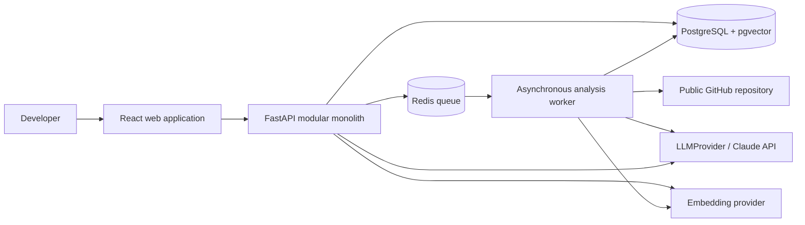
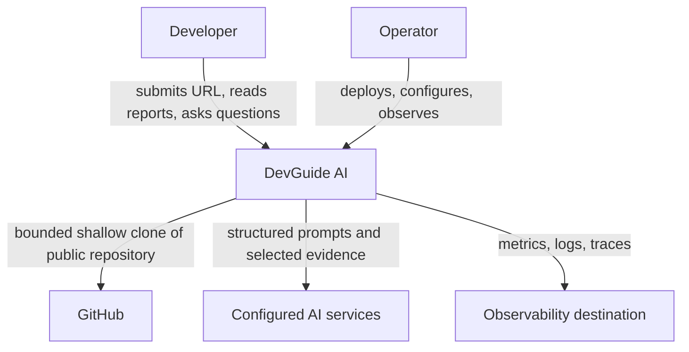
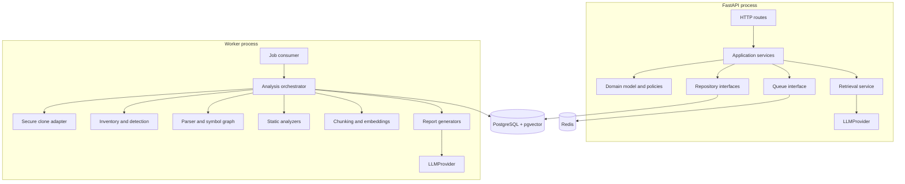
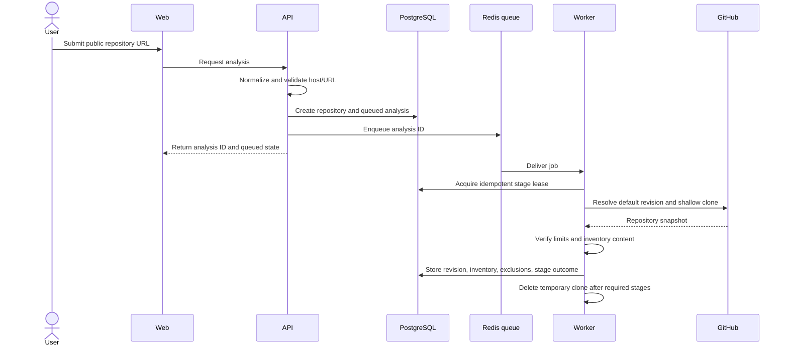
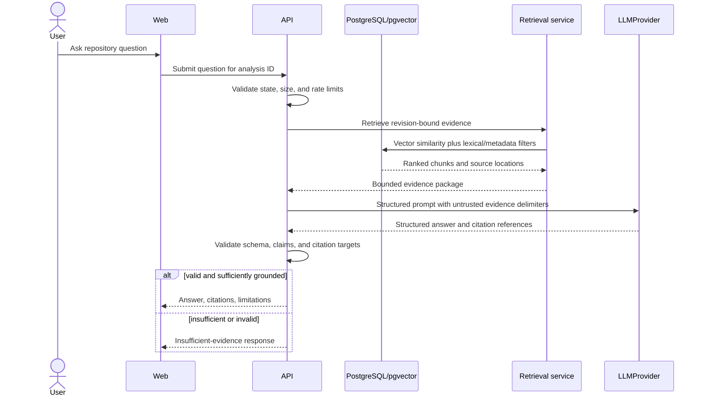
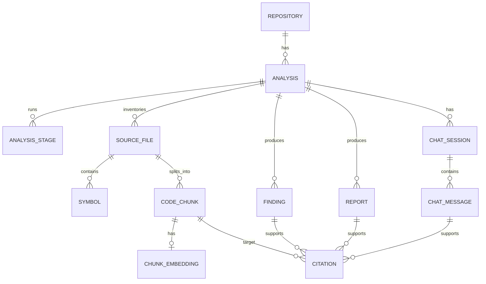
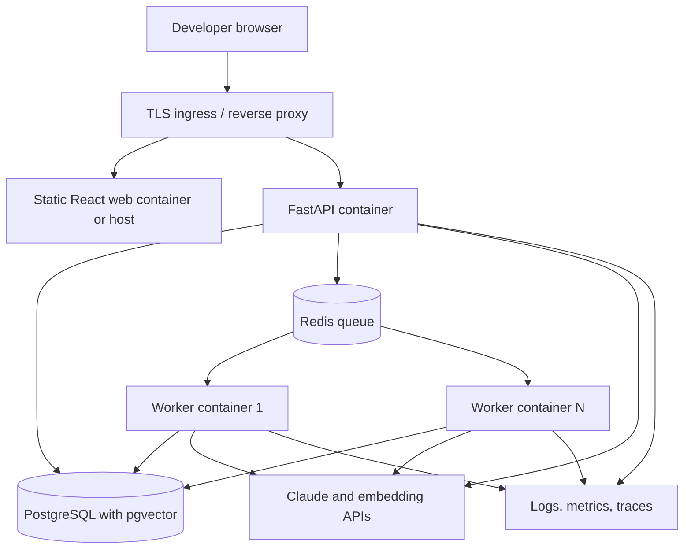

# DevGuide AI Planned Architecture

> Understand, improve, and ship unfamiliar codebases with confidence.

## 1. Document status

**Status:** Approved MVP architecture for implementation planning

**Implementation status:** Not implemented

**Architecture style:** Modular monolith with an asynchronous worker

This document describes how DevGuide AI is planned to work. It is not evidence that any application component, integration, deployment, test, or operational control currently exists. Requirements in `PRD.md` remain the product source of truth; this document explains a technical design intended to satisfy them.

## 2. Executive architecture summary

DevGuide AI is planned as three deployable processes sharing one product codebase and one data model:

- A React single-page application for repository submission, progress, reports, and cited chat.
- A FastAPI modular monolith for validation, orchestration, retrieval, persistence, and public HTTP contracts.
- A Python worker for bounded, asynchronous repository ingestion and analysis.

PostgreSQL stores product records, analysis artifacts, citations, and vector embeddings through pgvector. Redis provides the job queue and short-lived coordination. The worker securely performs a shallow clone of a public GitHub repository, inventories files, parses supported languages with tree-sitter, falls back to bounded plain text, extracts symbols and imports, runs non-executing static checks, creates code-aware chunks and embeddings, and persists revision-bound evidence.

Claude is the planned production language model behind an internal `LLMProvider` interface. `MockLLMProvider` supplies deterministic test behavior. All model outputs cross structured Pydantic validation, and material repository claims must cite file and line evidence. Repository content is untrusted data, never executable instructions. Normal analysis does not install dependencies, run builds, invoke repository scripts, or execute submitted code.

This design favors a modular monolith over microservices to reduce hackathon delivery and operational cost while retaining clear internal module boundaries and a separately scalable worker process.

## 3. Architecture goals

- Satisfy the PRD’s end-to-end public-repository analysis journey.
- Preserve traceability from claims to an immutable analyzed commit and source locations.
- Separate quick interactive requests from resource-intensive repository analysis.
- Make partial coverage, inference, uncertainty, and failures visible.
- Treat repository contents and metadata as hostile input.
- Enable deterministic testing without live model calls.
- Keep the MVP understandable and operable by a small hackathon team.
- Permit future scale-out without prematurely adopting microservices.

## 4. Assumptions

- MVP input is a public GitHub repository URL, not an uploaded archive or private repository.
- Each analysis resolves and records one immutable Git commit SHA.
- Repository size, file count, individual file size, clone duration, and analysis duration are configurable and bounded.
- Supported languages receive tree-sitter parsing; other eligible text receives explicitly limited fallback processing.
- Redis jobs use at-least-once delivery semantics, so stages must be idempotent.
- PostgreSQL is the durable system of record; Redis is not authoritative storage.
- Claude API and the selected embedding service are external dependencies. Exact models remain configuration decisions.
- Users may be anonymous for the hackathon, subject to rate limiting and retention rules still to be confirmed.
- Generated findings and explanations require human review.

## 5. Constraints

- Python 3.11+, FastAPI, Pydantic, SQLAlchemy 2, and Alembic are approved for backend and worker code.
- React, TypeScript, Vite, Tailwind CSS, TanStack Query, and React Router are approved for the frontend.
- PostgreSQL with pgvector and a Redis-backed queue are required.
- Claude must be accessed through `LLMProvider`; tests must be able to use `MockLLMProvider`.
- MVP uses a modular monolith plus asynchronous worker, not microservices.
- Normal analysis may read eligible repository content but may not execute repository code.
- Public HTTP API details remain to be formalized in `API_DOCUMENTATION.md` before implementation.
- Exact performance thresholds, supported-language matrix, retention, authentication, and deployment provider remain unresolved in the PRD.

## 6. High-level architecture

The browser communicates only with the FastAPI application. FastAPI validates requests, stores durable state, enqueues analysis work, serves results, and coordinates retrieval-backed chat. The worker consumes queued jobs and writes stage results to PostgreSQL. Both backend processes use shared domain and infrastructure modules from the modular monolith. External AI calls occur behind provider interfaces.

## 7. System context diagram

At system-context level, DevGuide AI has four external actors or systems: the developer, GitHub, the configured AI provider, and the deployment/operations environment.

Trust boundaries exist between the browser and API, DevGuide AI and GitHub, application code and untrusted repository content, and DevGuide AI and external AI services.

## 8. Container diagram

“Container” here means a separately runnable application or data service, not necessarily a Docker container.

| Container | Responsibility | Technology | Durable state |
| --- | --- | --- | --- |
| Web | User interface, routing, server-state presentation | React, TypeScript, Vite, Tailwind, TanStack Query, React Router | None beyond minimal browser preferences |
| API | Validation, use-case orchestration, result/query contracts, chat retrieval | FastAPI, Python 3.11+, Pydantic, SQLAlchemy 2 | PostgreSQL |
| Worker | Clone, inventory, parsing, static analysis, chunking, embedding, report generation | Python 3.11+, tree-sitter, shared domain modules | PostgreSQL |
| PostgreSQL | Product records, stage state, artifacts, citations, embeddings | PostgreSQL, pgvector | Yes |
| Redis | Queue, leases, deduplication hints, short-lived coordination | Redis-backed queue | No authoritative state |
| AI services | Language generation and embeddings through internal interfaces | Claude behind `LLMProvider`; embedding provider TBD | Provider-dependent and governed by policy |

## 9. Component diagram

The API and worker share a modular-monolith package. Dependencies point inward: transport and infrastructure adapt to application services and domain types.

Planned backend modules are `repositories`, `analyses`, `inventory`, `parsing`, `knowledge`, `reports`, `chat`, `ai`, and `platform`. These are code modules inside one application, not independently deployed services.

## 10. Repository ingestion flow

Ingestion turns a public URL into a bounded, revision-pinned local snapshot and inventory. The clone workspace is temporary and isolated from the application source tree.

Controls include an allowlisted GitHub HTTPS origin, disabled submodule recursion, no Git hooks, no credential forwarding, bounded clone depth, time/space limits, normalized paths, symlink handling, archive/large-file protections, and cleanup in success and failure paths.

## 11. Repository analysis pipeline

The pipeline records each stage independently so that safe partial results survive later failures.

Stages never run repository-defined commands. Framework detection uses manifests and source evidence; it does not install dependencies. Static analysis is limited to analyzers that inspect files without executing project code. Every stage stores its status, attempt, timings, coverage, and safe error category.

The implemented MVP worker currently runs `repository_ingestion`, `repository_parsing`,
`code_findings`, and `repository_intelligence` before publishing `ready`. Repository intelligence
uses persisted file identities and stores bounded, analysis-scoped local dependency edges,
entry-point evidence, and coupling counts. It supports Python AST imports and literal static
JavaScript/TypeScript import forms; unresolved, external, and dynamic imports create no edge.

## 12. Repository chat sequence

Chat is retrieval-augmented generation over a completed or qualified partial analysis. The model sees the question, strict instructions, and a bounded evidence set—not the entire repository.

The API rejects citation identifiers not present in the supplied evidence package. A response can be regenerated once under a bounded policy; persistent validation failure becomes a safe error or insufficient-evidence response.

## 13. Health-report sequence

1. The worker reads persisted inventory, dependency metadata, parser outputs, import relationships, and static-analysis signals.
2. Deterministic evaluators produce evidence-bearing observations such as missing expected documentation, parse coverage, dependency metadata, or detected code patterns.
3. A health-report application service normalizes findings into categories and records coverage and analyzer limitations.
4. The LLM may summarize and prioritize only the supplied findings through `LLMProvider`; it does not invent scanner results.
5. Pydantic validates the report structure, severity rationale, confidence, evidence references, and disclaimers.
6. Citation validation ensures each referenced file and line belongs to the analyzed commit.
7. The report is stored as complete or partial with stage coverage.

Potential security findings are review leads, not guaranteed vulnerabilities. The report is not a substitute for security testing or professional audit.

## 14. Frontend architecture

The planned frontend is a React and TypeScript single-page application built by Vite.

- **React Router** defines routes for submission, analysis status, report sections, and repository chat.
- **TanStack Query** owns server state, request deduplication, caching, polling, retries, and invalidation. It does not become a second durable source of truth.
- **Tailwind CSS** provides a constrained visual system with accessible semantic components.
- Feature folders align to user capabilities: repository submission, analysis status, overview, architecture, health, evidence viewer, and chat.
- Generated text and source excerpts are rendered as untrusted content with HTML sanitization and safe link policies.
- URLs use stable analysis identifiers; secrets and repository content do not enter browser storage.

Polling is the MVP status mechanism because it is simpler than WebSockets. The interval backs off and stops at terminal states. A later server-sent events option can reduce latency and polling traffic.

## 15. Backend architecture

FastAPI hosts a modular monolith organized into four layers:

1. **Transport:** routes, request/response schemas, authentication hooks, and exception mapping.
2. **Application:** use cases such as submit analysis, read results, ask question, and retry a failed stage.
3. **Domain:** entities, state transitions, evidence rules, policies, and provider-neutral interfaces.
4. **Infrastructure:** SQLAlchemy repositories, Redis queue adapter, Git client, parsers, analyzers, AI adapters, and observability.

Pydantic validates boundary data and structured AI results. SQLAlchemy 2 supplies explicit transactions and persistence mapping. Alembic versions database schema changes. Route handlers remain thin; domain transitions happen through application services. The same domain and infrastructure packages are imported by the worker, preserving one codebase without coupling work to HTTP requests.

## 16. Worker architecture

The worker is a separate Python process consuming analysis IDs from a Redis-backed queue.

- Jobs carry identifiers, not full repository contents.
- The worker reloads authoritative state from PostgreSQL.
- A stage orchestrator executes a directed sequence with persisted checkpoints.
- Each stage is idempotent for an analysis ID, commit SHA, stage name, and pipeline version.
- Leases and heartbeats prevent silent abandonment; durable stage state remains in PostgreSQL.
- Retry policy distinguishes transient external failures from permanent validation or content failures.
- Temporary clone directories have unique validated paths, quotas, and guaranteed cleanup.
- Worker concurrency is configurable and bounded separately from API concurrency.

Long analysis does not occupy an API request. The same worker image can later scale horizontally because jobs are idempotent and state is externalized.

## 17. AI architecture

The domain depends on an internal `LLMProvider` interface rather than the Claude SDK. Planned operations use task-specific typed inputs and outputs such as `generate_overview`, `explain_architecture`, `summarize_health`, and `answer_question` rather than an unrestricted generic prompt method.

- **Claude provider:** Production adapter for the approved Claude API. Exact model and version are configuration, recorded with each generated artifact.
- **Mock provider:** Deterministic fixture-driven implementation for unit, integration, failure, and Playwright tests.
- **Structured validation:** Pydantic schemas constrain output fields, citation identifiers, confidence labels, and limitations.
- **Evidence boundary:** Only selected, delimited chunks and metadata enter repository-specific prompts.
- **Provenance:** Artifacts record provider, model, prompt template version, retrieval version, source revision, and generated timestamp.
- **Safe fallback:** Invalid output, provider failure, or weak evidence produces bounded retry, partial status, or refusal; it does not silently fabricate a result.

The provider abstraction improves testability and future portability but does not guarantee drop-in equivalence across models. Prompts and evaluations must be rerun for provider changes.

## 18. Agent orchestration

The planned repository-intelligence agent is a bounded application orchestrator, not an autonomous shell user. It selects approved analysis skills based on persisted stage state and passes typed inputs between them.

Planned properties:

- A fixed allowlist of skills, such as inventory interpretation, architecture synthesis, health summarization, and cited question answering.
- No terminal, package manager, deployment, write-back, or repository-execution tool.
- Explicit budgets for steps, tokens, evidence volume, time, and retries.
- Deterministic state transitions persisted through the analysis orchestrator.
- Tool outputs treated as data and validated before reuse.
- Final outputs subject to the same structured and citation validation as direct AI tasks.

For MVP, orchestration should prefer a predefined workflow over open-ended planning. This is easier to test, safer against prompt injection, cheaper, and more predictable.

## 19. Retrieval architecture

Hybrid retrieval combines complementary signals:

- **Vector retrieval:** pgvector similarity over code-aware chunk embeddings.
- **Lexical retrieval:** PostgreSQL full-text or token-based matching for exact symbols, paths, configuration keys, and identifiers.
- **Structural retrieval:** filters and boosts for language, symbol, module, path, import relationship, chunk type, and analyzed revision.
- **Ranking:** merge normalized candidates, deduplicate overlapping chunks, diversify files, and cap evidence size.

Chunks preserve line ranges and symbol context. Code-aware boundaries prefer complete symbols and logical text sections, with bounded overlap. Query results are always filtered by analysis and commit SHA to prevent cross-repository leakage. The retrieval service returns opaque evidence IDs; only those IDs are valid citations for that generation request.

Future improvements may include graph-aware expansion, learned reranking, and incremental embeddings. Each adds latency and cost and must show measurable evaluation benefit.

## 20. Data model

PostgreSQL is the source of truth. The model separates repository identity, immutable analysis snapshots, pipeline execution, source evidence, generated artifacts, and user interactions.

Repository content is revision-scoped. Deleting or expiring an analysis must cascade through its source files, chunks, embeddings, reports, findings, chats, and citations according to the approved retention policy.

## 21. Core database entities

| Entity | Key fields | Purpose |
| --- | --- | --- |
| `Repository` | id, normalized URL, host, owner, name | Stable public repository identity without assuming mutable content |
| `Analysis` | id, repository_id, commit_sha, status, pipeline_version, coverage, timestamps | Immutable analysis snapshot and state machine |
| `AnalysisStage` | analysis_id, name, status, attempt, heartbeat, error_code, timings | Idempotency, progress, diagnostics, and recovery |
| `SourceFile` | id, analysis_id, path, language, size, digest, classification, skip_reason | Inventory and revision-bound file metadata |
| `Symbol` | id, source_file_id, kind, name, start_line, end_line, qualified_name | Parsed source structure |
| `ImportEdge` | analysis_id, source_symbol/file, target reference, resolution status | Structural relationships without implying perfect resolution |
| `RepositoryFileIntelligence` | analysis_id, repository_file_id, classification, entry-point evidence, inbound/outbound counts | Implemented per-file static structure metrics |
| `RepositoryDependencyEdge` | analysis_id, source/target file IDs, relationship, module, source line, confidence | Implemented resolved local dependency evidence |
| `AnalysisStructureMetadata` | analysis_id, limitations, timestamps | Implemented zero-edge readiness and limitations marker |
| `CodeChunk` | id, source_file_id, symbol_id, text or protected reference, line range, digest | Retrieval unit and citation target |
| `ChunkEmbedding` | chunk_id, model, dimensions, vector | Versioned semantic representation |
| `Finding` | analysis_id, category, rule, severity, confidence, status, rationale | Qualified health, maintainability, or potential-security observation |
| `Report` | analysis_id, type, schema_version, content, coverage, generator metadata | Overview, architecture, and health artifact |
| `Citation` | artifact/message/finding reference, chunk_id, file path, line range | Validated evidence relationship |
| `ChatSession` | id, analysis_id, timestamps | Conversation scope |
| `ChatMessage` | session_id, role, content, generation metadata, status | Question, cited answer, refusal, or error |

JSON columns may hold versioned structured artifacts, but query-critical status, ownership, revision, timestamps, and foreign keys remain relational. Vector dimensions and index type must match the selected embedding model.

## 22. API architecture

The planned HTTP API is resource-oriented and versioned under a stable prefix. `API_DOCUMENTATION.md` must define the actual contract before endpoints are implemented.

Expected resource families are repositories/analyses, analysis stages, reports, findings, chat sessions/messages, and operational health. Submitting an analysis returns an identifier and asynchronous state rather than waiting for completion. Status reads are safe and idempotent. Creation requests should support an idempotency key to reduce duplicate analysis.

API responses use Pydantic schemas, stable machine-readable error codes, correlation IDs, and explicit partial-result metadata. Pagination applies to findings, files, and messages. Authentication, anonymous access, rate limits, retention endpoints, and streaming remain unresolved product decisions.

## 23. Security architecture

Security is layered around trust boundaries:

- **Input:** strict URL parsing, GitHub host allowlist, scheme restrictions, SSRF defenses, and configurable resource limits.
- **Clone:** shallow clone, immutable commit capture, no submodule recursion, no hooks, no repository credentials, constrained filesystem, time/space quotas, and cleanup.
- **Analysis:** read-only non-executing parsers; no builds, package installation, test execution, or repository commands.
- **Application:** validation, least privilege, authorization when introduced, rate limiting, safe error messages, CSRF/CORS policy, and secure headers.
- **Data:** TLS in transit, encryption at rest supplied by deployment infrastructure, minimal retention, tenant/repository scoping, and parameterized database access.
- **AI:** minimal evidence disclosure, content delimiters, tool restrictions, output validation, citation allowlists, and provider data-handling policy.
- **Operations:** secrets manager or injected environment variables, non-root containers, patched base images, dependency scanning, backups, audit-relevant events, and incident procedures.

Public source code can still contain secrets or personal information; “public” does not remove the need for minimization and redaction.

## 24. Threat model

| Threat | Example | Planned control | Residual risk |
| --- | --- | --- | --- |
| SSRF and URL confusion | Crafted URL reaches internal services | Parse and normalize URL; allowlist GitHub HTTPS hosts; resolve and validate destinations | DNS/provider behavior still requires testing |
| Malicious repository filesystem | Traversal, symlink escape, huge files | Isolated temp root, normalized paths, quotas, symlink policy, bounded reads | Parser/library flaws remain possible |
| Code execution | Build scripts or parser exploit | Never execute project code; sandbox worker; patch parsers; least privilege | Native parser vulnerabilities require defense in depth |
| Prompt injection | README asks model to ignore rules | Treat content as quoted data; fixed prompts; no dangerous tools; validate outputs | Model behavior is probabilistic |
| Cross-repository data leak | Retrieval returns another analysis’s chunk | Mandatory analysis/revision filters and authorization checks | Implementation defects must be tested |
| Secret disclosure | Public repo contains active key | Secret-pattern redaction, limited prompts/logs, safe report rendering | Detection is not complete |
| Resource exhaustion | Huge history or compressed content | Shallow clone, limits, timeouts, queue backpressure, quotas | Sophisticated inputs may consume bounded capacity |
| Citation forgery | Model invents a path or line | Opaque evidence IDs and post-generation validation | Evidence can still be misinterpreted |
| Supply-chain compromise | Dependency or image compromised | Locks, provenance, scanning, minimal images, updates | No control eliminates supply-chain risk |
| Abuse and cost attack | Automated submissions or chat | Rate limits, quotas, idempotency, usage monitoring | Anonymous access limits attribution |

## 25. Prompt-injection defense

Repository text is never trusted as instruction, even when it appears in `AGENTS.md`, comments, documentation, issue templates, or source strings. The planned controls are:

1. System and task instructions are authored by DevGuide AI and kept separate from evidence.
2. Retrieved content is wrapped in explicit untrusted-data boundaries with stable evidence IDs.
3. The model receives no shell, network, file-write, deployment, or repository-execution tool.
4. Agent skills use fixed allowlists, typed inputs, budgets, and deterministic transitions.
5. Outputs are parsed into Pydantic schemas; unknown fields and invalid citation IDs are rejected.
6. Citation targets are checked against the exact evidence set and commit.
7. Suspicious instruction-like content may be flagged, but filtering alone is not treated as sufficient defense.
8. Adversarial repository fixtures test instruction override, data exfiltration requests, fabricated citations, and unsafe recommendations.
9. Failures produce refusal or partial results, never expanded tool authority.

Prompt injection cannot be claimed as completely solved; the design minimizes consequence and measures behavior.

## 26. Error handling

Errors use stable categories: validation, inaccessible repository, limit exceeded, upstream rate limit, clone failure, unsupported content, parse failure, index failure, AI provider failure, structured-output failure, citation failure, timeout, cancellation, conflict, and internal failure.

Each error has:

- A safe user message and machine-readable code.
- A retryable/non-retryable classification.
- A correlation ID.
- An affected stage and coverage impact.
- Internal diagnostic context without secrets or full source content.

API exception mapping avoids stack traces in responses. Stage failures do not automatically invalidate previously completed evidence. Chat returns insufficient evidence when that is more accurate than a technical answer.

## 27. Failure recovery

- Persist stage checkpoints and outputs transactionally before acknowledging work.
- Use idempotency keys for submission and stage identity.
- Retry transient GitHub, Redis, database, embedding, and Claude failures with bounded exponential backoff and jitter.
- Do not retry malformed input, configured-limit violations, or consistently invalid content automatically.
- Detect abandoned stages through leases/heartbeats and return them to the queue after a safety interval.
- Send jobs exceeding retry policy to a failed/dead-letter state for operator review.
- Resume from the last valid stage when pipeline and artifact versions remain compatible; otherwise start a new analysis snapshot.
- Preserve qualified partial reports when safe and expose missing stages.
- Clean temporary clones in `finally` paths and through a separate stale-workspace janitor.

Database backup and restoration objectives remain a deployment decision. Redis loss may require re-enqueuing non-terminal analyses from PostgreSQL.

## 28. Observability

The design uses OpenTelemetry-compatible traces, metrics, and structured logs, with a deployment-specific backend selected later.

Planned metrics include request rate/latency/errors, queue depth and age, stage duration/outcomes, worker utilization, clone and parsing coverage, retrieval candidate counts, AI latency/error/token use, citation validation failures, partial analyses, and retention cleanup outcomes.

Dashboards should follow the user journey from submission through terminal analysis and chat. Alerts should focus on actionable symptoms such as sustained queue age, terminal failure spikes, provider errors, database saturation, and cleanup failure. No benchmark or alert threshold is asserted until a load profile is approved.

## 29. Logging and correlation IDs

The API creates or validates a correlation ID for each request. Analysis ID, job ID, stage name, attempt, chat message ID, and provider request identifier propagate through queue metadata and telemetry.

Logs are structured JSON in deployed environments. They exclude source content, embeddings, prompts, generated answers, credentials, full repository URLs, and full user questions by default. Paths may be hashed or redacted where analytics or diagnostics do not require them. Error fingerprints retain enough context to debug without exposing repository data.

Correlation IDs are returned in error responses and are not authorization tokens.

## 30. Performance considerations

- Keep submission lightweight and move clone/analysis work to the queue.
- Enforce early limits before expensive parsing, embeddings, or generation.
- Batch database inserts and embedding requests within provider limits.
- Use content digests to avoid duplicate chunk work within an analysis and enable future reuse.
- Index common relational filters and add an appropriate pgvector index only after representative data testing.
- Bound chunk sizes, retrieval candidates, prompt evidence, and chat history.
- Poll analysis status with backoff; consider server-sent events later.
- Cache immutable report reads with revision-aware keys only when needed.

The architecture adopts the PRD’s performance targets as goals but does not invent throughput or benchmark results. Profiling and representative repository fixtures must guide tuning.

## 31. Scalability strategy

MVP scale is vertical for API/PostgreSQL plus horizontal worker replicas. Queue backpressure protects external providers and the database. Independent concurrency pools can limit clone, parsing, embedding, and generation work.

Growth path:

1. Tune queries, indexes, batching, and worker concurrency.
2. Add API and worker replicas behind a load balancer.
3. Introduce read replicas or managed database scaling if measured reads require it.
4. Partition or archive analysis data by retention and access patterns.
5. Move large raw artifacts to object storage if PostgreSQL size becomes inefficient.
6. Extract a module into a service only when ownership, scaling, reliability, or security evidence justifies the operational cost.

Microservices are not the default future destination; modular boundaries permit selective extraction.

## 32. Cost implications

Primary variable costs are AI tokens, embeddings, worker compute, repository transfer, PostgreSQL/pgvector storage, and retained artifacts. Redis, observability, backups, and network egress add operational cost.

Controls include repository limits, early rejection, code-aware deduplication, bounded retrieval, prompt budgets, model selection by task, cached immutable artifacts, short configurable retention, concurrency caps, and usage quotas. `MockLLMProvider` removes live AI spend from automated tests.

Claude was selected for the approved MVP, but exact model economics are unresolved. Provider usage and model version must be measurable per analysis without logging source content. Future optimization should be evaluated against factual support and citation quality, not cost alone.

## 33. Deployment architecture

Local development uses Docker Compose for consistent dependencies and processes. Production-like deployment uses separately scalable container images or process commands for web, API, and worker, plus managed or containerized PostgreSQL/pgvector and Redis according to environment.

Containers run as non-root with read-only application filesystems where feasible, writable bounded temporary volumes for clones, health checks, resource limits, and injected secrets. Database migrations run as a controlled release step, not concurrently from every replica. Exact cloud, regions, TLS termination, backup service, and availability topology remain unresolved.

## 34. CI/CD architecture

GitHub Actions is the planned CI control plane.

Pull-request checks should include:

- Backend formatting, linting, type checks, Pytest unit/integration tests, and migration validation.
- Frontend formatting, linting, TypeScript checks, Vitest tests, and production build.
- Playwright tests against a disposable Compose environment using `MockLLMProvider`.
- Secret, dependency, container, and static security scanning.
- Architecture/documentation link and Mermaid validation where practical.
- Container builds with reproducible tags and recorded provenance.

Deployment should promote an immutable tested image, run a migration gate, perform health checks, and support rollback to the previous compatible release. Protected environments and least-privileged credentials separate CI from deployment. The current bootstrap workflow does not yet provide this pipeline.

## 35. Testing architecture

- **Pytest unit tests:** domain policies, state transitions, parsers, chunking, ranking, validation, and prompt/citation safeguards.
- **Pytest integration tests:** PostgreSQL/pgvector repositories, Alembic migrations, Redis queue behavior, idempotency, retries, and provider adapters through fakes.
- **Vitest tests:** React components, route states, query behavior, accessible interactions, report rendering, and error/partial states.
- **Playwright tests:** submission-to-report-to-chat journeys, invalid URLs, timeouts, partial results, citations, and insufficient-evidence behavior using deterministic fixtures.
- **Security tests:** hostile paths, symlinks, oversized files, SSRF variants, prompt injection, output injection, cross-analysis retrieval, and secret redaction.
- **AI evaluations:** versioned repositories and questions measuring factual support, citation validity, refusal behavior, and false positives.
- **Performance tests:** representative repository classes and approved load profiles without invented targets.

Live Claude smoke tests, if any, remain isolated, budgeted, non-blocking for routine development, and free of sensitive repositories. CI’s reliable path uses `MockLLMProvider`.

## 36. Day 2 surprise-feature extensibility

Hackathons often introduce a late requirement. The design provides extension seams without changing the core topology:

- `LLMProvider` and embedding interfaces permit provider or model variants after evaluation.
- Versioned analysis stages allow a new analyzer or report section to join the pipeline.
- Agent skills use typed contracts and an allowlist, enabling a bounded new skill.
- Report schemas are versioned and can add optional sections without breaking old analyses.
- Feature-based React routes and query keys can expose a new result view.
- Hybrid retrieval accepts new scorers, metadata filters, or graph expansion.
- Queue jobs carry analysis IDs and stage versions, allowing targeted recomputation.

A surprise feature must still respect no-code-execution, evidence, privacy, and security constraints. Extensibility is not permission to bypass architecture review.

## 37. Trade-offs

The following decision matrix records why each major choice was selected and its operational consequences.

| Decision | Why selected / alternatives | Advantages | Disadvantages | Scale and performance | Security | Cost | Future improvement |
| --- | --- | --- | --- | --- | --- | --- | --- |
| Modular monolith + worker | Fastest coherent MVP; alternative was microservices or fully synchronous app | One model/codebase, simple transactions, easier debugging | Modules can become coupled without discipline | API and workers scale separately; database remains shared bottleneck | Fewer network trust boundaries | Lower deployment/operations cost | Extract only measured hotspots or ownership boundaries |
| React/Vite SPA | Approved ecosystem; alternatives include server-rendered frameworks | Fast development, typed UI, strong testing ecosystem | Browser depends on API; SEO is not a focus | Static assets scale cheaply; polling adds API load | Must sanitize generated content and secure browser/API boundary | Low hosting cost | Add SSR only if product needs justify it; consider SSE for status |
| FastAPI/Python | Aligns with parsing and AI ecosystem; alternatives include Node or Go | Typed schemas, async HTTP, shared worker language | CPU work must leave request process; Python concurrency limits | Scale API replicas and worker processes; optimize CPU-bound parsing | Mature validation helps but does not replace controls | Broad hosting support | Profile and isolate native parsing where needed |
| PostgreSQL + pgvector | One durable store for relational and vector data; alternative is separate vector database | Transactions, fewer systems, strong filtering | Vector scale may eventually pressure primary database | Adequate for bounded MVP; index tuning required | Centralized authorization and backups | Avoids separate vector-service cost | Introduce object/vector stores only from measured need |
| Redis-backed queue | Simple asynchronous coordination; alternatives include database queue or managed broker | Mature queue patterns and horizontal workers | Another dependency; delivery is at least once | Backpressure and worker scale-out | Must isolate network/access and avoid authoritative state | Small additional infrastructure cost | Managed Redis or stronger broker if durability requirements grow |
| Shallow Git clone | Accurate Git snapshot and revision; alternative is GitHub file APIs/archive download | Natural tree, commit pinning, efficient history avoidance | Git-specific attack surface and disk use | Bounded clone improves latency; large working trees remain costly | Requires strict host, path, hook, submodule, time, and disk controls | Network and ephemeral compute | Evaluate archive/API ingestion for specific scale or security needs |
| tree-sitter + text fallback | Structured multi-language parsing; alternatives are regex or language servers | Symbol/line precision without running code | Grammar coverage and version maintenance; fallback has weaker semantics | Incremental/native parsing can be fast but needs quotas | Native parsers require patching and sandboxing | Mostly compute and maintenance | Add languages based on evaluation demand; isolate parsers if needed |
| Hybrid retrieval | Code queries need semantic and exact matching; alternatives are vector-only or lexical-only | Better support for concepts, paths, and symbols | Ranking complexity and evaluation burden | More queries and ranking work but bounded candidates | Strict analysis filters prevent cross-repository mixing | Embedding plus database cost | Add reranking/graph expansion only if metrics improve |
| Claude behind `LLMProvider` | Approved provider with portability boundary; alternative is direct SDK coupling or another provider | Testability, structured task interfaces, future migration seam | Abstraction cannot hide model behavior differences | External latency/rate limits require budgets and backoff | Provider policy and prompt-injection controls are essential | Variable token cost | Evaluate model tiers/providers against a versioned benchmark |
| Structured evidence-backed generation | Required for trust; alternative is free-form text | Validatable outputs, traceability, safer failure | Validation/retry complexity and occasional refusals | Adds validation latency but reduces unusable output | Blocks arbitrary citation and narrows prompt impact | Possible retry cost | Improve claim-level grounding and automated evaluations |
| Docker Compose + containers | Reproducible local/demo setup; alternatives are native setup or orchestration-first | Environment parity and simple onboarding | Local resource use; production orchestration unresolved | Container replicas support horizontal growth | Enables isolation but images and runtime need hardening | Low MVP cost; managed services later add cost | Select hosting and deployment topology after load/security decisions |

## 38. Rejected alternatives

- **MVP microservices:** Rejected because service boundaries, distributed transactions, network failure modes, duplicated contracts, and deployment overhead would slow delivery without established scale or team boundaries.
- **Synchronous repository analysis in API requests:** Rejected because clone, parsing, embeddings, and generation can exceed request lifetimes and complicate recovery.
- **Executing repository builds or tests:** Rejected for normal analysis because arbitrary code execution creates unacceptable security, cost, and isolation complexity and conflicts with the PRD.
- **Vector-only retrieval:** Rejected because exact symbols, filenames, and configuration identifiers often need lexical and structural matching.
- **Direct Claude SDK calls throughout modules:** Rejected because it couples domain behavior to a provider and makes deterministic testing difficult.
- **Redis as durable analysis storage:** Rejected because eviction and transient queue semantics do not meet source-of-truth needs.
- **Free-form AI output without schema validation:** Rejected because citations, uncertainty, and report structure would be unreliable to consume.
- **Cloning full Git history:** Rejected because MVP analysis is revision-scoped and history adds time, storage, and attack surface.

## 39. Architecture Decision Records

The following ADRs should be created in `docs/decisions` before or alongside implementation:

| ADR | Decision | Status in this document |
| --- | --- | --- |
| ADR-001 | Modular monolith with asynchronous worker | Confirmed |
| ADR-002 | React/Vite frontend and FastAPI/Python backend | Confirmed |
| ADR-003 | PostgreSQL/pgvector durable storage and Redis queue | Confirmed |
| ADR-004 | Secure shallow clone with no repository code execution | Confirmed |
| ADR-005 | tree-sitter parsing with bounded text fallback | Confirmed |
| ADR-006 | Hybrid retrieval and revision-bound citations | Confirmed |
| ADR-007 | Claude behind `LLMProvider` with `MockLLMProvider` | Confirmed |
| ADR-008 | Retention, deletion, and repository-content storage | Proposed; details unresolved |
| ADR-009 | Authentication, authorization, and anonymous access | Unresolved |
| ADR-010 | Production hosting, secrets, backups, and observability providers | Unresolved |

This task does not create separate ADR files because it is scoped exclusively to `architecture.md`.

## 40. Known limitations

- No described component is implemented.
- Language and framework coverage is not yet selected or validated.
- Tree-sitter and static checks cannot recover all runtime behavior or architecture.
- Plain-text fallback provides weaker structural understanding.
- Import resolution is incomplete in dynamic, generated, conditional, or unusual build systems.
- Shallow snapshots do not explain historical intent.
- Hybrid retrieval can omit relevant evidence or rank weak evidence highly.
- AI output can be incorrect even when citations are syntactically valid.
- Security and maintainability findings can contain false positives and false negatives and are not audits.
- Public repositories may contain sensitive material; retention and redaction policies remain unresolved.
- PostgreSQL/pgvector may require redesign at substantially larger data volumes.
- Anonymous MVP access, if chosen, limits abuse attribution.

## 41. Future improvements

- Add measured language and framework coverage, parser isolation, and deterministic graph analysis.
- Support incremental analysis and safe artifact reuse across commit snapshots.
- Add graph-aware retrieval and reranking after evaluation proves value.
- Move large source artifacts to encrypted object storage if database cost or size requires it.
- Add private repositories only after authentication, authorization, consent, retention, and provider-handling reviews.
- Introduce controlled share links, team workspaces, and audit trails.
- Improve secret detection/redaction and user-controlled deletion.
- Add model routing, caching, and provider fallback behind evaluated interfaces.
- Add server-sent events if polling latency or load becomes material.
- Establish disaster recovery, multi-zone availability, and capacity objectives for production use.

## 42. Hackathon checkpoint mapping

| Checkpoint | Architecture coverage | Current implementation status |
| --- | --- | --- |
| Technology stack | Sections 5, 8, 14–17, 33–35, and 37 name and justify the approved stack | Planned only |
| Data model | Sections 20–21 define revision-scoped entities, relationships, embeddings, findings, reports, chats, and citations | Planned only |
| High-level design | Sections 6–13 provide system, container, component, ingestion, analysis, chat, and health flows | Planned only |
| Custom agent and skill readiness | Section 18 defines bounded orchestration and skill contracts | Not implemented |
| Evidence-backed AI | Sections 17, 19, and 25 define provider abstraction, hybrid retrieval, validation, and citation controls | Not implemented |
| Security posture | Sections 23–25 define trust boundaries, threat model, no-execution rule, and prompt-injection defense | Not implemented or tested |
| Green pipeline and tests | Sections 34–35 define intended CI, Pytest, Vitest, and Playwright coverage | Bootstrap workflow only; full pipeline and tests are not implemented |
| Container delivery | Section 33 defines local Compose and planned container deployment | Compose remains a placeholder |

The checkpoint is met at the design-document level when judges can trace the approved stack, data model, system flows, key decisions, risks, and limitations. It does not establish working application compliance.

## Confirmed decisions

- Modular monolith with a separately runnable asynchronous worker; no MVP microservices.
- React, TypeScript, Vite, Tailwind CSS, TanStack Query, and React Router frontend.
- FastAPI on Python 3.11+ with Pydantic, SQLAlchemy 2, and Alembic.
- PostgreSQL with pgvector as durable relational and embedding storage.
- Redis-backed asynchronous queue with PostgreSQL-held authoritative state.
- Secure shallow cloning of public GitHub repositories and no normal execution of repository code.
- tree-sitter parsing where supported, bounded plain-text fallback, symbol/import extraction, non-executing static analysis, code-aware chunks, embeddings, and hybrid retrieval.
- Claude API behind `LLMProvider`, deterministic `MockLLMProvider` tests, structured output validation, and revision-bound file/line citations.
- Pytest, Vitest, Playwright, Docker Compose, GitHub Actions, and container-based delivery.

## Decisions still unresolved

- Exact supported languages, frameworks, grammars, static analyzers, file types, and repository limits.
- Exact Claude and embedding models, embedding dimensions, provider retention settings, token budgets, and evaluation gates.
- Authentication, authorization, anonymous use, quotas, and sharing behavior.
- Repository content storage format, retention period, deletion workflow, redaction policy, and data region.
- Health categories, scoring/weighting, severity taxonomy, and acceptable false-positive rates.
- Public API resource details, idempotency semantics, pagination, versioning policy, and status transport.
- Queue library, worker lease values, retry counts, dead-letter operations, and cancellation behavior.
- Production hosting provider, network topology, secrets manager, object storage, observability backend, backups, and recovery objectives.
- Approved load profile, performance environment, accessibility level, and demo repository set.

## Architecture risks

- Probabilistic AI output may remain wrong or misleading despite grounding and validation.
- Prompt injection cannot be eliminated; controls primarily reduce authority and consequence.
- Parser defects or malicious repositories can pressure worker isolation and resource bounds.
- Retrieval quality and citation validity may not equal semantic correctness.
- pgvector in the primary database may become a performance or storage bottleneck at scale.
- External GitHub, Claude, and embedding dependencies introduce latency, outages, limits, privacy considerations, and variable cost.
- Undefined retention, authentication, and hosting decisions block a production-grade security assessment.
- Broad MVP analysis scope may exceed hackathon time unless the supported matrix and health rules are tightly bounded.

## Consistency with the PRD

- **Aligned:** Public GitHub URL submission, revision-bound inventory, supported-content disclosure, technology detection, repository overview, qualified architecture explanation, important modules, health reporting, cited chat, insufficient-evidence behavior, progress states, partial results, and configurable limits all have planned architectural support.
- **Aligned:** The architecture treats potential security and maintainability findings as non-exhaustive review leads, not guaranteed vulnerabilities or audits.
- **Aligned:** Repository content is untrusted; prompt-injection controls, no code execution, redaction, least privilege, and deletion/retention seams reflect PRD security and privacy requirements.
- **Aligned:** Correlation IDs, stage outcomes, retries, partial recovery, deterministic mocks, Pytest, Vitest, Playwright, and CI map to PRD reliability and demo criteria.
- **Open rather than conflicting:** The PRD leaves model/provider policy unresolved, while this approved architecture now selects Claude behind an abstraction. The PRD should later record that confirmed product decision.
- **Open rather than conflicting:** The PRD does not fix authentication, retention, size limits, exact language coverage, health scoring, deployment provider, or production load profile; this architecture intentionally leaves them unresolved.
- **Scope caution:** PRD `FR-011` and `FR-012` are conditional, while the product vision mentions maintainability and security risks broadly. Implementation must define a narrow hackathon rule set and preserve coverage disclosures.
